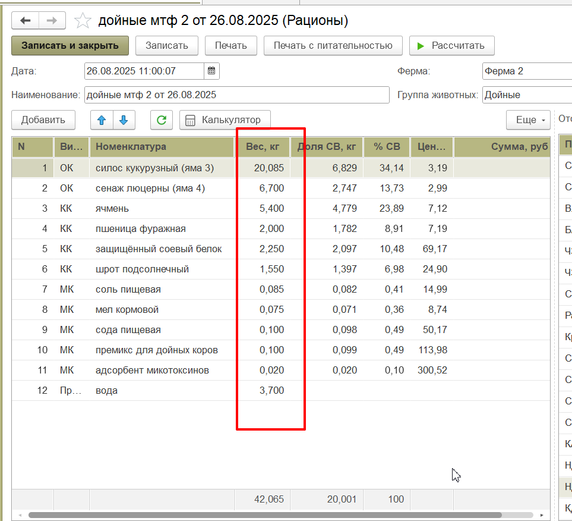
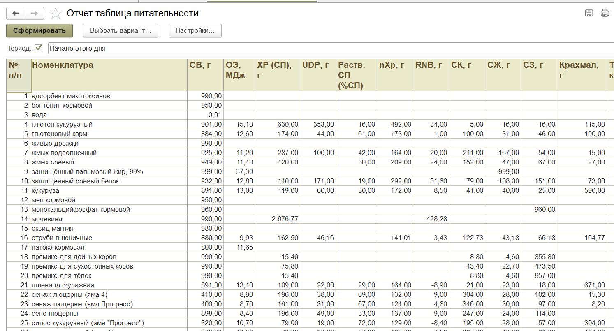
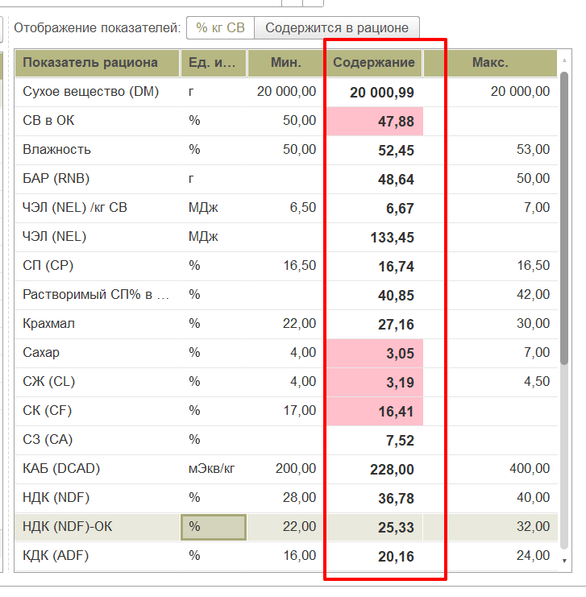
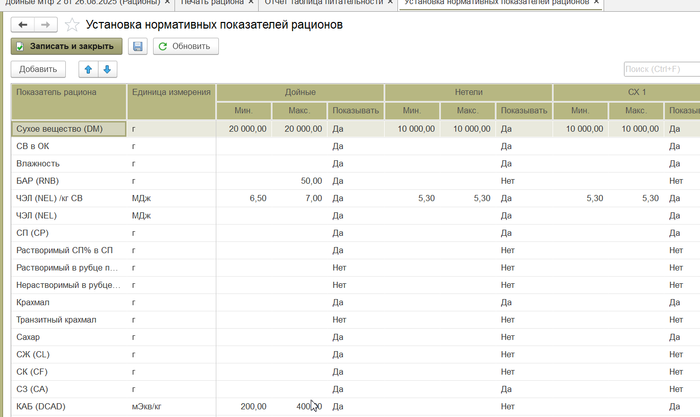
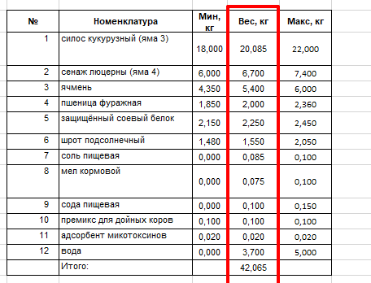

# Авторацион

*Document Type: DOCX*

Авторацион

При авторацине изменится форма, добавится 2 колонки.

Как выбирать в чём работаем, в ручной форме, или в авто?

В администрировании, или на форме рациона?

Сейчас мы вручную задаём необходимое кол-во кг корма, чтобы сбалансировать рацион.

Это вносим, вручную. У каждого корма есть показатели питательности.

И на основании питательно выбранных кормов и заданного кол-ва кг, программа рассчитывает параметры и сравнивает их с нормативом.

Содержание – это рассчитано на основании выбранных кормов/их количества.

Мин, Макс, это заданные параметры.

Здесь задаём параметры.

Задача авторациона, на основании нормативных показателей, рассчитать нужное количество корма.

Мы выбрали корма, указали диапазон веса, с которым программа может работать. Например силос кукурузный, не может быть больше 22 кг и меньше 18 кг, и так по всем кормам. Так же может указать мин=макс, например премикс, значит его нужно 100 гр.

Программа должна так перебирать комбинации кормов, чтобы содержание входило в макс/мин ( не было красных значений).

Чтобы содержание получилось как в примере выше, программа вычислила, что в рационе должно содержаться такое кол-во корма.

Вопрос: идеального рациона не будет, всегда будут красные значения, что делать в таких случаях? Предлагать изменить диапазон веса и/или записать как есть (если пользователя устроит)?

