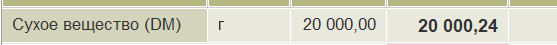
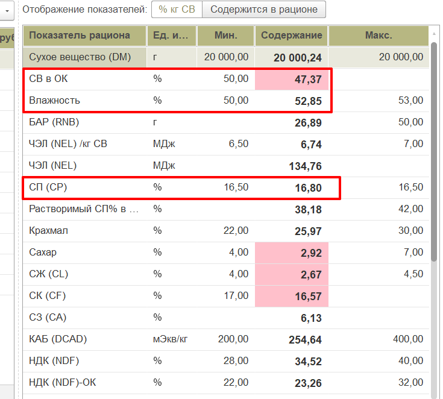

# Для чего нужен мин и макс

*Document Type: DOCX*

Для чего нужен мин и макс?

Чтобы ограничить вес вводимого корма:

Экономически – корм дорогой, в рационе должно быть определённое кол-во, чтобы цена рациона была оптимальной.
Кол-во корма – я знаю остаток и чтобы его хватило на определённый период нужно ввести в рацион необходимое кол-во.
Замещаемость кормов – силос и сенаж имеют несколько общих показателей, но сенажа и силоса должно быть определённое кол-во. Например сенажа больше 7 кг в рационе не должно быть, а программа сделает 10 (при этом уменьшил силос).

Основные показатели на которые я ориентируюсь:

Сухое вещество, это самый первый показатель.

Вот остальные важные показатели.

Приоритет расчёта.

Сухое вещество
СП
СВ в ОК
Влажность.

Остальные показатели находятся в диапазоне, который легко сбалансируется.

Для всех показателей можно сделать погрешность  - 5%.

